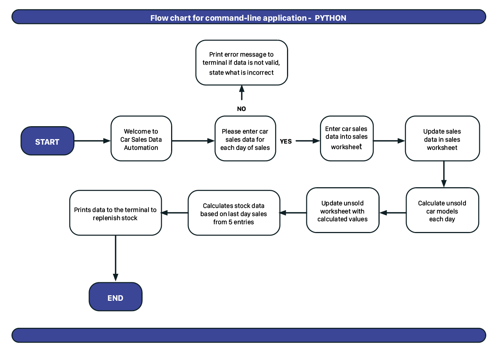

# Grand Auto _"where every car is a steal"_

Python command-line application to manage car sales for a dealership knowing whom has entered in the data and the sales they have made for each day.
When 'python3 run.py' is entered into the terminal, a prompt will appear to ask your name, when this is entered, a personalised message appears to 
ask for your car sales for that day, it explains the way the data should be entered, how and where. Once you have correctly entered the data a message will
appear to say you have a valid entry! If you do not have a valid entry you will be asked again. The sales worksheet will be updated accordingly.
As you can see from the flow chart below the command line application will ask user to enter the car sales for each day, for:

-  Sedan
-  Coupe
-  Sports car
-  Station wagon
-  Hatch back
-  Sports suv

The comand-line application will update this information to the sales google sheet, update that google sheet below last data entry, tell you when this is
updated sucessfully. Then it moves onto calculating what cars are left from each day of sales by subtracting sales from stock worksheet and updates the unsold
cars worksheet below the last data entry and informs the user that this has been completed. Ater completing those tasks the terminal advises which stock to replenish.

The live link can be found here - https://github.com/nedduc/Car-Sales

### Flow Chart

### Bugs
I was able to remove all bugs as they were easy enough to fix. Mostly indentation or white spaces, to make a long line shorter on line 13 of python.
Most of my research was done on https://learn.codeinstitute.net/courses/, https://stackoverflow.com/ and https://www.w3schools.com/

### Features left to Implement

- Other features to implement colours of cars bought (best selling colour)
- Colunm for diseal vs petrol
- Must-have features: Think backup camera, leather seats, Apple CarPlay, etc.
- Lease or Buy

### PEP8 online Validator Testing  

- (http://pep8online.com/)
  - Input will be inserted by user. Testing was carried out with PEP8 online for python code. With no errors found.
  

## Deployment to Heroku

Heroku is a platform designed to host dynamic websites. While Github pages hosts projects built with front end languages like HTML, CSS and JavaScript,
it's not built to host back end languages, which is why I have to use Heroku for this deployment. After using a Python essentials template
from Code Institute, changes that needed to be made in order to deploy to Heroku.

  - New line character '\n' needs to be added to the text inside the input method.
  This is to be added as there is a quirk in the software used to create the mock terminal.
  Without this extra line, the text for the import request will not show up in the terminal. 
  - Create a list of requirements that our project needs to run. The template we used to create our Gitpod workspace installed several things,
  and then we manually installed gspread and google-auth into the workspace as well. These packages are known as a dependencies. In order for
  my project to run on Heroku I need to install these dependencies as well, this list will go into my requirements.txt file. to create the list, I type
  'Pip3 freeze > requirements.txt' into the terminal. Heroku will search for this exact file name as it build my project. Hit enter and the requirements.txt has been updated.
- Making sure all my recent file update has been to github.
- Heruko free account has been created.
- Important! Another V=config Var needs to be added to Heroku settings to improve compatibility with various Python libraries.
- From Heroku dashboard click create new application, give your project an unique name, select your region and click "Create app"
- Go to the setting tab this must be done first, in Config vars where sensitive data is stored as the CREDS.json my sensitive file, these credentials are needed in order to connect to our API.
as the Heroku is separate workspace it still needs these files to access, copy the entire CREDS.json file and paste it into the value field, I have already named the Key field as CREDS, if you did not want access to this .json file there is no need to set any Config vars.
- Next I needed to add a couple of buildpacks to my app. Further dependencies that I need outside of the requirements.txt file, so I click 'Add buildpacks" first being python, second node.js in that order otherwise you will have to re-arrange and click save. 
- Deploy section select github, find repository name, then click connect to link up the two.
- You can set up automatic deploys which will rebuild your app every time you push a new change  
to your code to Github. Or you can choose to manually deploy using this deploy branch option here.  

## Credits 
(https://learn.codeinstitute.net/courses/course-v1:CodeInstitute+LS101+2021_T1/courseware/293ee9d8ff3542d3b877137ed81b9a5b/58d3e90f9a2043908c62f31e51c15deb/)
(https://www.w3schools.com/)(https://www.youtube.com/channel/UC8n8ftV94ZU_DJLOLtrpORA)
Tutor support without it, I would be stuck.